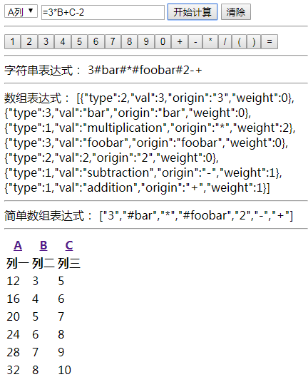

# 批量数据表达式引擎 #

## 构建和测试 ##

- 安装npm依赖：`npm install`
- 执行构建：`npm run build`
- 运行自动化测试：`npm run test`，访问页面`http://localhost:9876`
- 运行DEMO：`npm run start`，访问页面`http://localhost:9877`

## 表达式规范 ##

- 支持加减乘除和小括号语法（+-*/()）
- 字段名使用一对#号包围
- 表达式中的空格会被忽略
- 等号（=）开头的情况，解析等号后的字符串，求解表达式赋值。
- 不是等号开头的情况，直接把字符串赋值。

**示例：** (#foo# + #bar# * (#foobar# - #bar#)) / #foo#

## API ##

### createCallback 生成用于数组map方法参数的回调函数 ###

参数列表：

- field：需要赋值的字段名
- expression：符合表达式规范的表达式字符串

### util 辅助工具类 ###

#### createColumnAlias 根据列的序号生成大写字母表示列别名 ####

 * @param num {Integer} 列的数字序号
 * @return {String} 列的别名

#### createColumnAliasByIndex 根据列的索引生成大写字母表示列别名 ####

 * @param idx {Integer} 列的数字索引
 * @return {String} 列的别名

#### function convertLRDArray(expression) ####

将符合表达式规范的字符串转换为后根遍历的数组形式。

#### function convertLRDSimpleArray(expression) ####

将符合表达式规范的字符串转换为后根遍历的简单数组形式。

#### function convertLRDString(expression) ####

将符合表达式规范的字符串转换为后根遍历的字符串形式。
